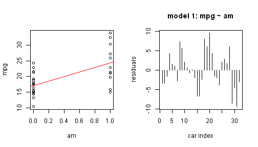

## Slide 2: MPG vs. Automatic/Manual Transmission


```r
data(mtcars)
par(mfrow = c(1, 2))
plot(mpg ~ am, mtcars)
fit1 <- lm(mpg ~ am, data = mtcars)
abline(fit1, col = "red")
plot(residuals(fit1), type = "h", main = "model 1: mpg ~ am", xlab = "car index", 
    ylab = "residuals", )
```

 


--- .class #id 

## Slide 3: MPG vs. Weight


```r
data(mtcars)
par(mfrow = c(1, 2))
plot(mpg ~ wt, mtcars)
fit2 <- lm(mpg ~ wt, data = mtcars)
abline(fit2, col = "red")
plot(residuals(fit2), type = "h", main = "model 2: mpg ~ wt", xlab = "car index", 
    ylab = "residuals", )
```

 


--- .class #id 

## Slide 4: MPG vs. Cylinder


```r
data(mtcars)
par(mfrow = c(1, 2))
plot(mpg ~ cyl, mtcars)
fit3 <- lm(mpg ~ cyl, data = mtcars)
abline(fit3, col = "red")
plot(residuals(fit3), type = "h", main = "model 3: mpg ~ cyl", xlab = "car index", 
    ylab = "residuals", )
```

 


--- .class #id 

## Slide 5: Residuals Comparison

### Residuals for mpg ~ am

```
## [1] 720.9
```

### Residuals for mpg ~ wt

```
## [1] 278.3
```


### Residuals for mpg ~ cyl

```
## [1] 308.3
```


### From above, MPG is more related with Weight.


